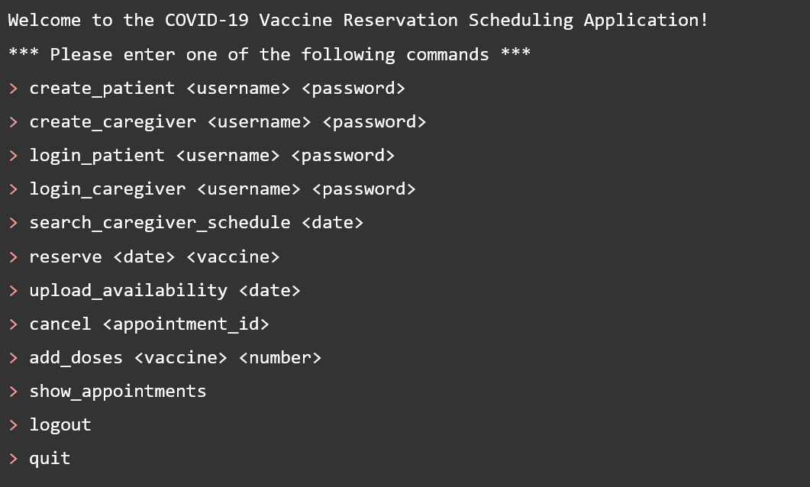
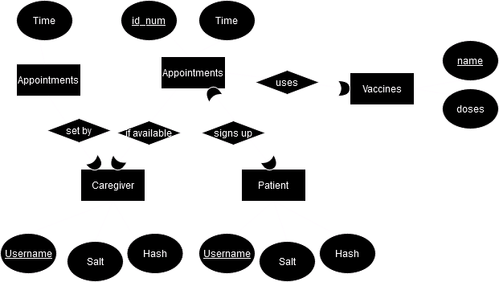

## Vaccine Appointment Scheduler

Simple vaccine scheduler using pymssql.

- Requires connecting to an SQL server database via pymssql (see `src/main/scheduler/db/ConnectionManager.py`).
- Create appropriate tables in the database using `create.sql` under `src/main/resources`.
- While connected, run `Scheduler.py` to use the scheduler.

### Database design:

